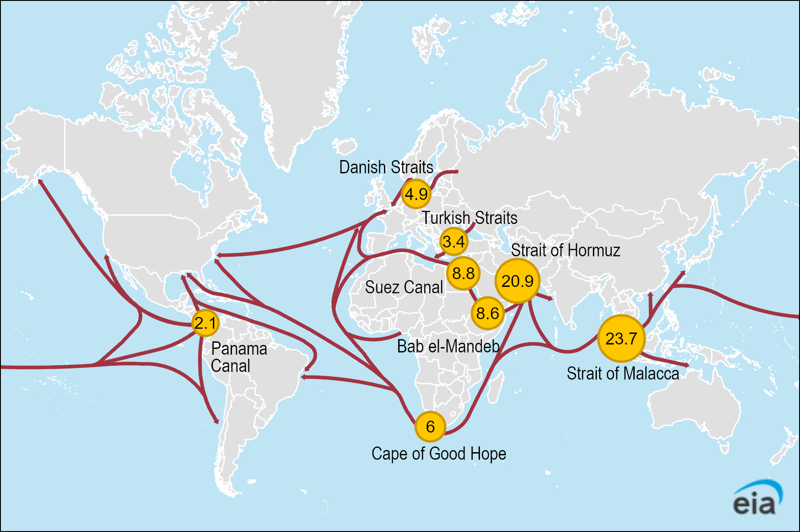
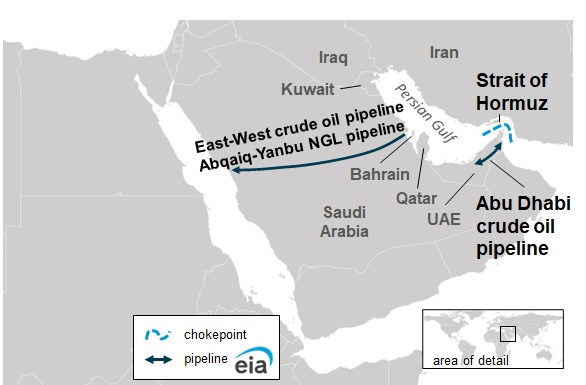
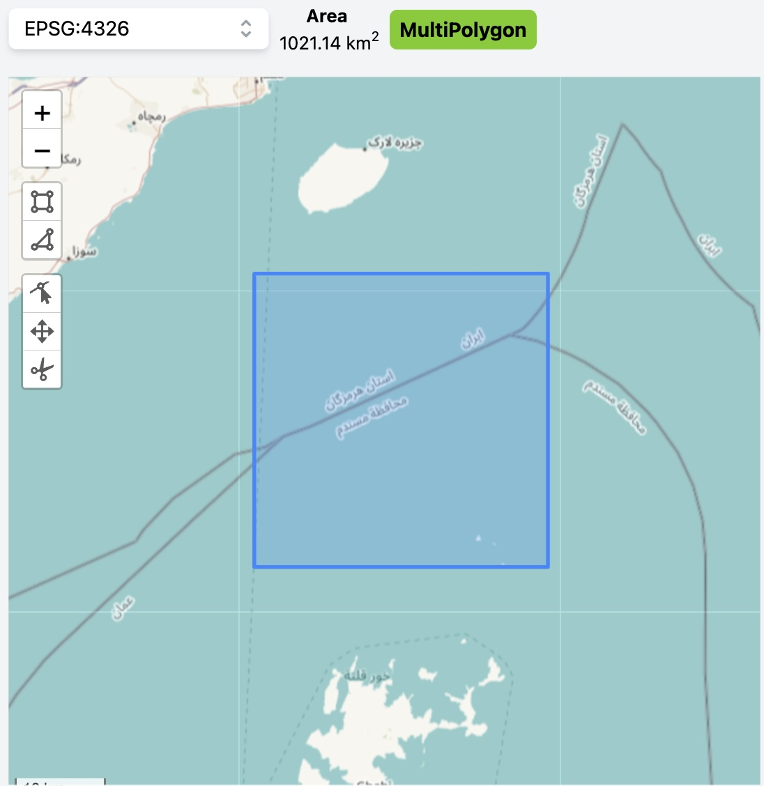
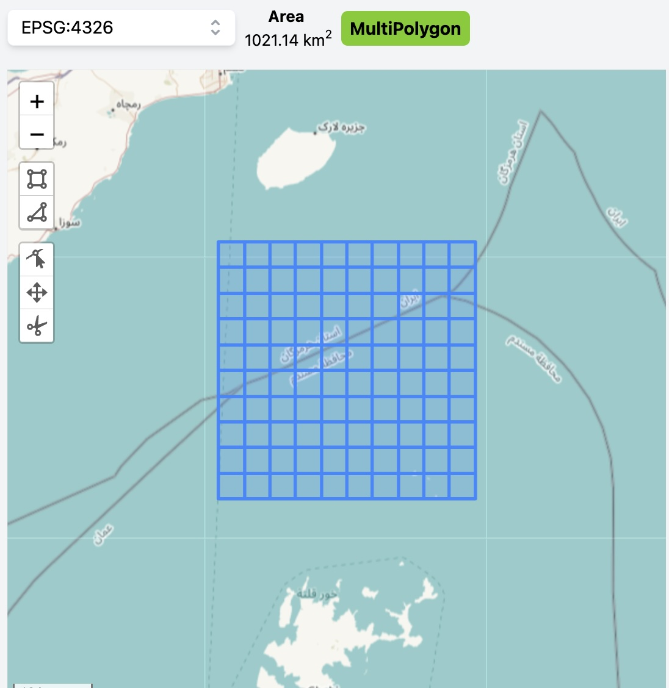
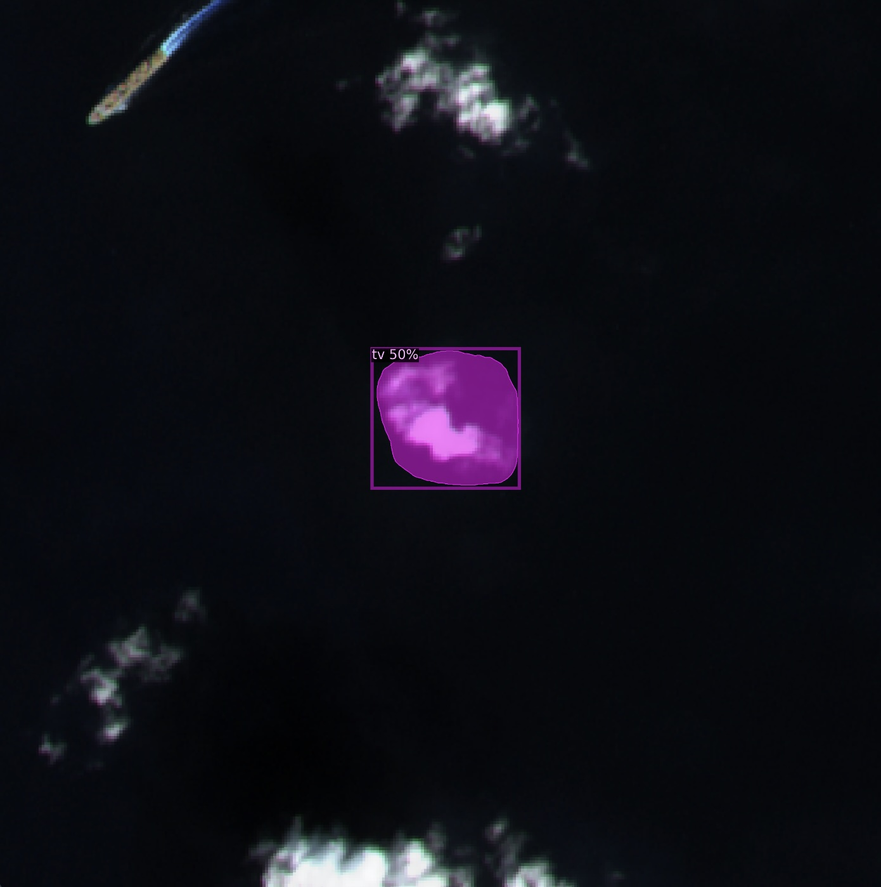
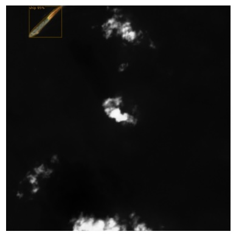

# Weekend Project: Monitoring Maritime Traffic in the Strait of Hormuz

## Introduction

This project aims to explore the potential of satellite imagery analysis for tracking ship movements in the Strait of Hormuz, one of the world's most critical oil chokepoints. In 2023, the U.S. Energy Information Administration (EIA) estimated that about 76% of total world petroleum and other liquids supply (77.5 million barrels per day) traveled via seaborne trade, with a significant portion passing through strategic waterways like the Strait of Hormuz.

The Strait of Hormuz is particularly important, as it is estimated that flows through this strait in 2023 made up more than one-quarter of total global seaborne traded oil. Additionally, around one-fifth of global liquefied natural gas (LNG) trade also transited the Strait of Hormuz in the same year.

This project utilizes open-source satellite data from the Copernicus Sentinel-2 mission to detect and track ships in a 1000 km² area where the strait is at its narrowest. The goal is to develop a model capable of accurately identifying vessels in high-resolution satellite imagery, potentially providing insights into maritime traffic patterns in this crucial region. The area was split into a 10x10 grid for higher resolution.

| Sentinel Entire Area         |  Sentinel Grid Layout           |
|:-------------------------:|:-------------------------:|
|   |    |

The project utilizes a combination of satellite imagery processing and machine learning techniques:

1. **Data Collection**: Sentinel-2 satellite images of the Strait of Hormuz are collected for the period from 2018 to 2024.

2. **Image Processing**: The collected images are processed using various filters, with a focus on the false color filter, which proved most effective for ship detection in this maritime setting.

3. **Detection Algorithm**: Initially, I attempted to use a default model of Detectron2, Facebook AI Research's state-of-the-art library for object detection and segmentation, which encountered some issues. To improve results, I switched to training my own model utilizing an open-source dataset [HRSID](https://github.com/chaozhong2010/HRSID), a dataset specifically designed for ship detection, semantic segmentation, and instance segmentation tasks in high-resolution SAR images. Moreover, during this part, I switched to Jupyter Notebook format to use the Kaggle notebook environment, leveraging their free access to NVIDIA Tesla P100 GPUs for faster training.

| Default Model              |  Trained Model             |
|:-------------------------:|:-------------------------:|
|   |    |

## Challenges and Limitations

- The default model initially used had some problems, necessitating a switch to a more specialized dataset and model.
- False positives remain a significant challenge, potentially addressable by combining multiple datasets or incorporating Sentinel-1 data, as this increases the array of datasets.
- Too lenient cloud coverage caps may result in many false positives.
- Due to data extraction limitations, only data from the first weeks of 2018 were included in the initial statistics.

This project serves as a starting point for exploring the possibilities of satellite imagery analysis in maritime traffic monitoring. While it has limitations and areas for improvement, it demonstrates the potential for using publicly available data and open-source tools to gain insights into global maritime activities.
